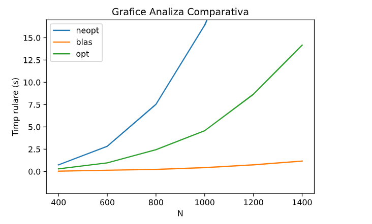

# Tema 2 ASC
# Sulimovici Raoul-Renatto 331CB

Pentru toate metodele am tinut cont de forma matricei A (superior triunghiulara), astfel indicii cu care iterez prin aceasta matrice
vor fi diferiti de cei normali (0 -> N) si vor incepe de la indexul liniei curente pentru A, respectiv se vor termina la indexul
liniei curente pentru A transpus.

## neopt
Aceasta metoda va tine cont doar de forma matricei A, cum am mentionat mai sus.
Voi face pe rand inmultirile, folosind 3 for-uri ca in laborator, modificand doar indecsii corespunzator si o adunare cu 2 for-uri.
La inmultirea cu B_t, am decis sa nu transpun matricea B si, in schimb, am parcurs-o pe linii in loc de coloane, lucru care este echivalent in operatie.
Asemanator am facut si la A_t x A, unde am parcurs matricea A pe coloane in loc de linii pentru a simula transpunerea matricei.
```
Run=./tema2_neopt: N=400: Time=0.747984
Run=./tema2_neopt: N=600: Time=2.834365
Run=./tema2_neopt: N=800: Time=7.538070
Run=./tema2_neopt: N=1000: Time=16.405756
Run=./tema2_neopt: N=1200: Time=29.194471
Run=./tema2_neopt: N=1400: Time=50.236938
```

## blas
Pentru aceasta metoda am alocat matricele necesare si le-am copiat valorile necesare.
Am realizat prima oara operatia "A x B" folosind functia cblas_dtrmm, care tine cont de forma superior triunghiulara a matricei a.
Dupa care am realizat "A_t x A" asemenea ca mai sus.
La final am folosit cblas_dgemm, prin care am inmultit rezultatul primei operatii cu transpusa matricei B si am adunat acest rezultat la "A_t x A".
```
Run=./tema2_blas: N=400: Time=0.037375
Run=./tema2_blas: N=600: Time=0.140533
Run=./tema2_blas: N=800: Time=0.238549
Run=./tema2_blas: N=1000: Time=0.432290
Run=./tema2_blas: N=1200: Time=0.745313
Run=./tema2_blas: N=1400: Time=1.168161
```

## opt
Pentru aceasta metoda am folsit mai multe optimizari:
1. Am eliminat constantele din bucle, folosind o variabila locala sum, astfel operatiile pentru calcularea indexului facandu-se o singura data.
2. Am folosit variabile de tipul register, care vor retine datele direct in registrii procesorului, astfel operatiile fiind mai rapide (se elimina overhead-ul accesului la memorie/cache).
3. Am transpus matricele A si B pentru a beneficia de localitatea spatiala a cache-ului. (Se vor parcurge toate matricele linie cu linie, astfel rezultand un numar mai mic de miss-uri). In loc sa inmultesc A si B pe linii, respectiv coloane, am inmultit A si B_t pe linii, respectiv linii si analog pentru celelalte inmultiri.

Inafara de optimizarile mentionate mai sus si de optimizarea legata de forma matricei A, implementarea este asemanatoare cu cea de la neopt, asa cum este cerut si in enunt.

```
Run=./tema2_opt_m: N=400: Time=0.299155
Run=./tema2_opt_m: N=600: Time=0.969092
Run=./tema2_opt_m: N=800: Time=2.448821
Run=./tema2_opt_m: N=1000: Time=4.578099
Run=./tema2_opt_m: N=1200: Time=8.663284
Run=./tema2_opt_m: N=1400: Time=14.175742
```

Timpii de rulare pentru N=1200 sunt tot timpul mai mici decat 12s, uneori fiind mai mici si de cele 8s.

## valgrind
Niciuna dintre implementari nu prezinta probleme de acces la memorie, lucru care poate fi vazut in fisierele .memory din arhiva.

## cachegrind
Output-ul se afla in fisierele .cache.
### neopt
    Se observa ca din cele 6 miliarde de instructiuni (I refs), 3 miliarde (D refs) au accesat cache-ul sa citeasca si 76 milioane au fost miss-uri. Rezulta un miss rate de 2.6%.
    Legat de branch-uri, au fost 131 de milioane, dintre care 490.000 au fost mispredict-uite, de unde rezulta un mispred rate de 0.4%.
### opt
    Se observa ca din cele 3 miliarde de instructiuni (I refs), 782 milioane (D refs) au accesat cache-ul sa citeasca si 16 milioane au fost miss-uri. Rezulta un miss rate de 2.2%.
    Legat de branch-uri, au fost 131 de milioane, dintre care 490.000 au fost mispredict-uite, de unde rezulta un mispred rate de 0.4%.
### blas
    Se observa ca din cele 232 milioane de instructiuni (I refs), 90 milioane (D refs) au accesat cache-ul sa citeasca si 1.7 milioane au fost miss-uri. Rezulta un miss rate de 1.9%.
    Legat de branch-uri, au fost 4 de milioane, dintre care 42.000 au fost mispredict-uite, de unde rezulta un mispred rate de 1.1%.

Cel mai bun raport hit-miss este obtinut de blas, dupa care opt si neopt. (Cum este si ordinea fireasca).
Neopt si Opt au acelasi mispred rate, pe cand blas are un branch prediction rate mai prost.

## Analiza Comparativa



La o dimensiune de 1400, implementarea blas va fi de aproximativ 14 ori mai rapida decat opt si de aproximativ 50 de ori mai rapida decat neopt.
La dimensiunu mai mici, diferenta nu este la fel de mare, insa foarte sesizabila.
Forma curbei blas aproape se suprapune cu axa Ox, iar celelalte doua sunt exponentiale.
Runtime-ul pentru blas este optim, mult mai bun decat celelalte doua variante.

Pentru grafic am folosit python3, matplotlib si numpy.